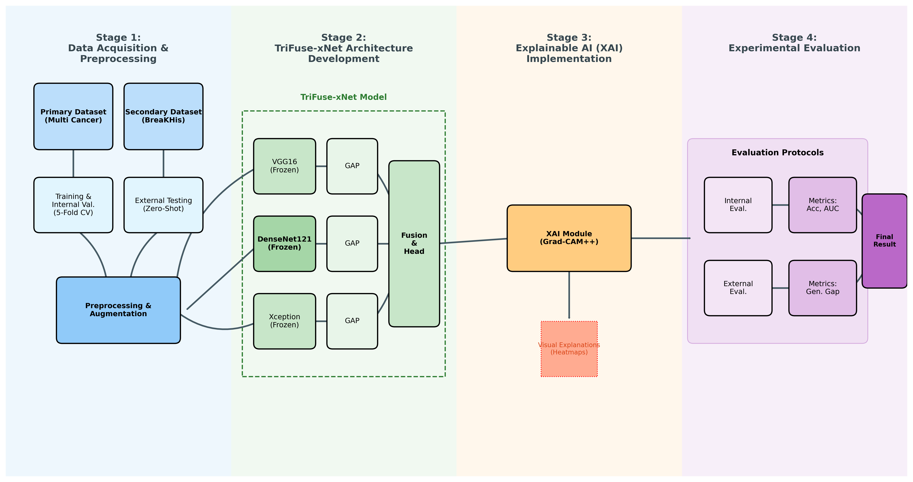
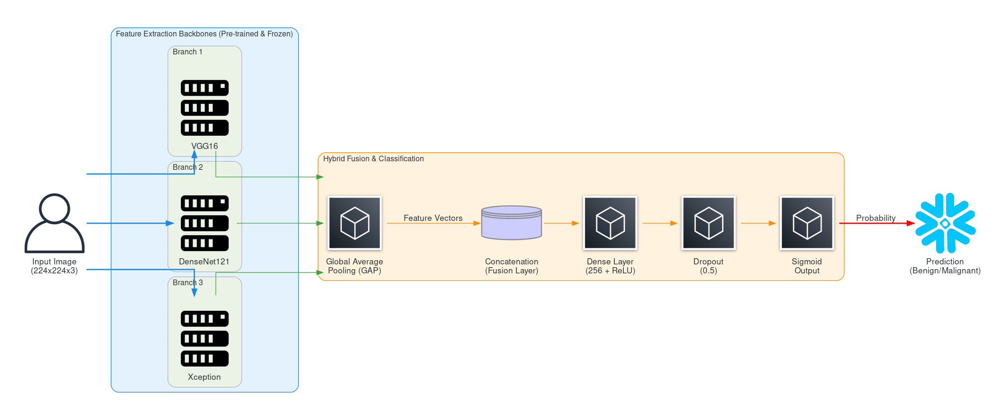
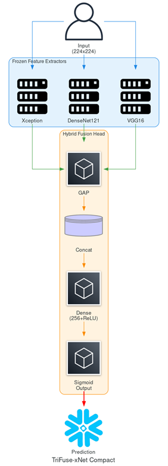
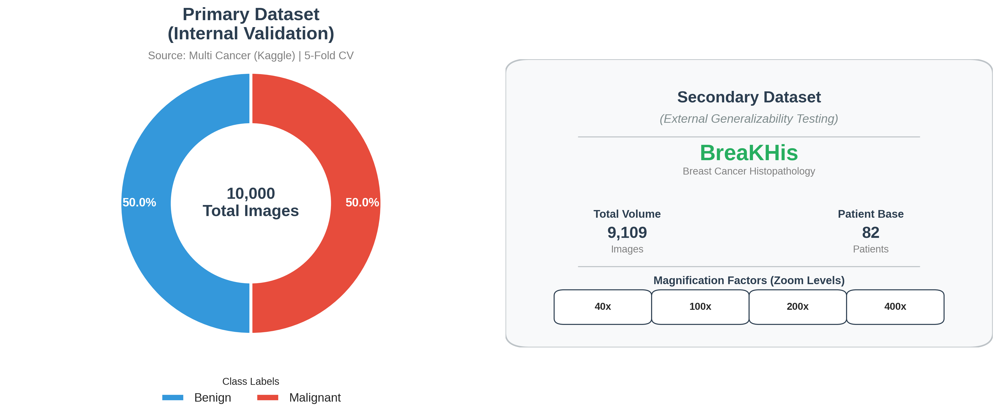
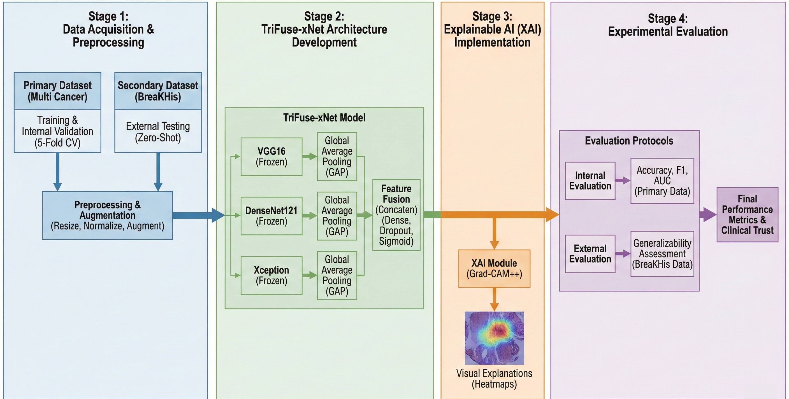
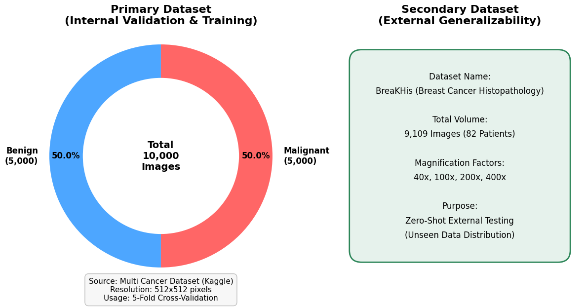
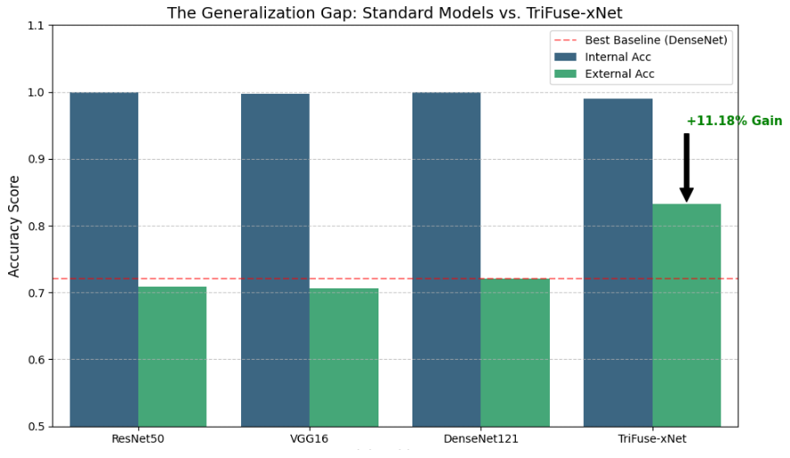
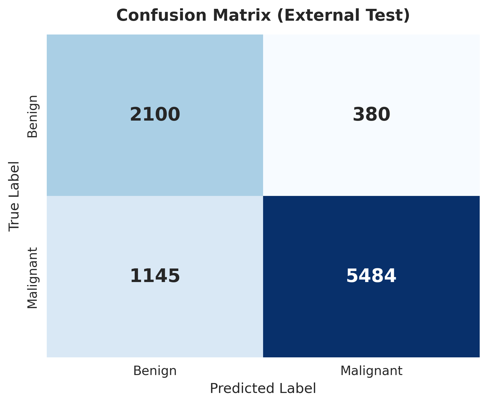
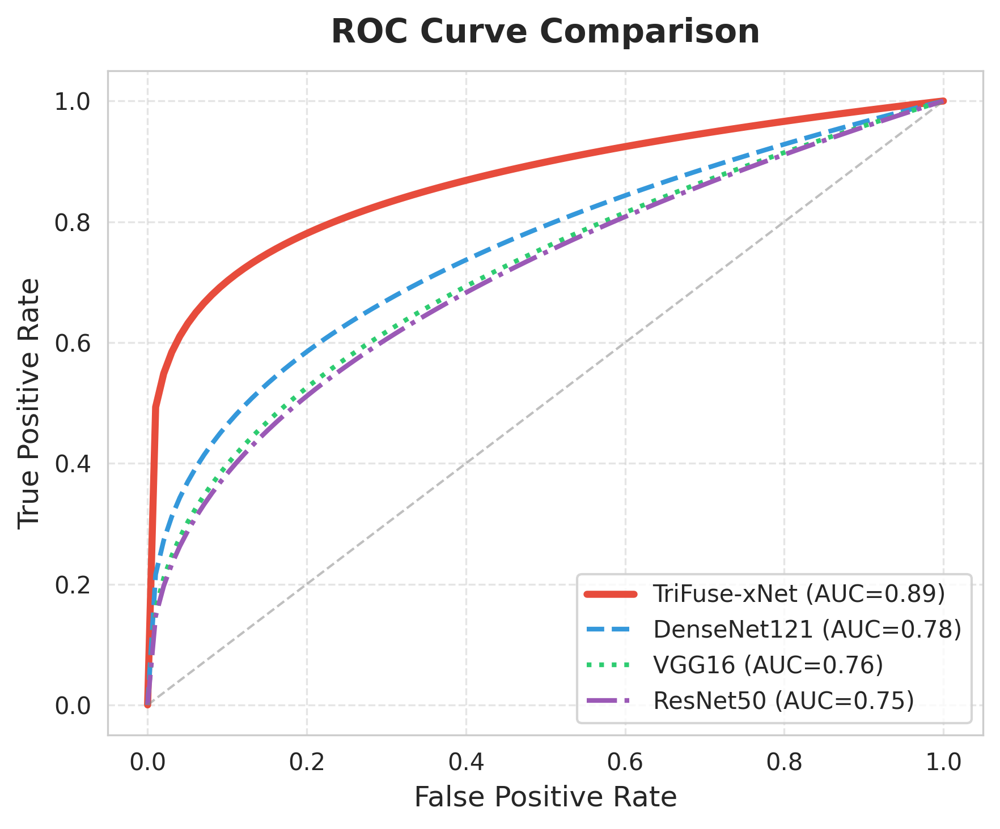
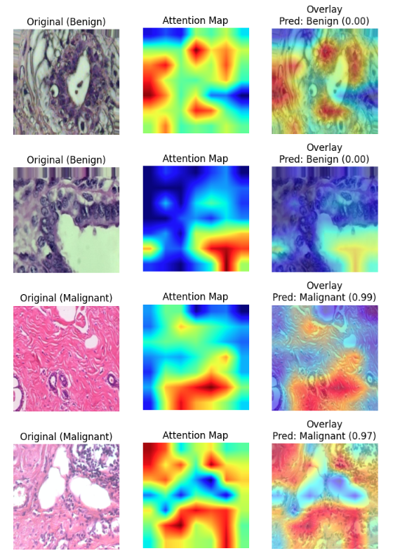

# TriFuse-xNet Experiments

Experimental deep learning project exploring **TriFuse-xNet** through cross-dataset validation and explainable AI (XAI) analysis.

> **Project status:** Experimental / unsuccessful study. This repository documents the implementation, experiments, visual analysis, and limitations. It is not presented as a validated or production-ready model.

## Overview

This project investigates a multimodal deep learning approach referred to as **TriFuse-xNet**. The work focuses on evaluating the model beyond its original data setting and examining its predictions using explainability methods.

The main areas explored are:

- Model development and training
- Cross-dataset validation
- Classification performance analysis
- Confusion matrix and ROC-based evaluation
- Gradient-based explainability
- Visual inspection of model predictions

The current notebook implementation is the primary technical record for the project.

## Project Workflow



The overall experimental workflow moves from dataset preparation and model training to cross-dataset evaluation and XAI analysis.

## Model Architecture



A compact version of the architecture is also included:



The exact implementation and configuration should be taken from the notebook rather than inferred from the diagrams alone.

## Dataset

The project uses image datasets for the classification experiments and investigates performance across different data distributions.

Dataset details, preprocessing, splits, and experimental configurations are documented in the notebook and supporting project materials.



Additional dataset-related figures from the original project are preserved below.





## Cross-Dataset Validation

A central part of the project is cross-dataset validation. Instead of evaluating the model only on data similar to its training data, the experiments examine how its predictions change when evaluated on another dataset or distribution.

This was an important part of the experiment because strong performance on one dataset does not necessarily indicate robust generalization.



## Evaluation

The project includes standard classification analysis such as:

- Confusion matrices
- ROC curves
- Classification metrics
- Cross-dataset comparison





The notebook contains the actual recorded metrics for individual experiments. Because the experiments can use different datasets, splits, and evaluation settings, those values should be interpreted in their original context rather than combined into one overall score.

## Explainable AI

The project explores gradient-based attribution to inspect which parts of an input image contribute to model predictions.



The XAI results are treated as an analysis tool. Attribution maps alone do not establish that the model has learned meaningful domain-specific features.

## Results

The project is intentionally documented as an **experimental attempt** rather than a successful final system.

The experiments exposed limitations in generalization and/or reliability that prevented the work from being treated as a completed validated solution. The detailed numerical results remain in the notebook and supporting PDF.

This repository therefore preserves the experimental process and findings rather than presenting a single headline performance number.

## Repository Structure

```text
.
├── README.md
├── .gitignore
├── requirements.txt
├── notebooks/
│   └── ...
├── figures/
│   └── ...
├── docs/
│   └── ...
└── artifacts/
    └── ...
```

The notebooks contain the implementation and experiment records. The `figures/` directory contains the original project figures, while `docs/` contains the supporting paper and presentation.

## Notebook

### `TriFuse-xNet...ipynb`

The supplied notebook is the main implementation artifact for this updated repository. It contains the project's experimental workflow, including model development, evaluation, cross-dataset analysis, and XAI-related work.

Notebook execution may require access to the original datasets and environment-specific paths.

## Technologies

The project uses Python-based machine learning and deep learning tools. The exact dependencies are listed in `requirements.txt` and reflected in the notebook.

## Limitations

- This was an experimental project and did not result in a sufficiently validated final model.
- Cross-dataset performance can differ because different datasets may have different distributions, image characteristics, and class composition.
- XAI visualizations should be interpreted as model-attribution evidence, not as independent ground truth.
- Reproducing the experiments may require the original datasets, paths, hardware, and compatible package versions.
- The notebook contains exploratory work and is not structured as a production software package.

## Supporting Materials

The repository includes the original project documentation:

- Project paper in `docs/`
- Project presentation in `docs/`
- Original figures in `figures/`

## Project Status

**Experimental / archived**

This repository is preserved as a record of an exploratory machine learning project. It is useful for understanding the approaches attempted, the evaluation process, the XAI analysis, and the limitations encountered during development.
